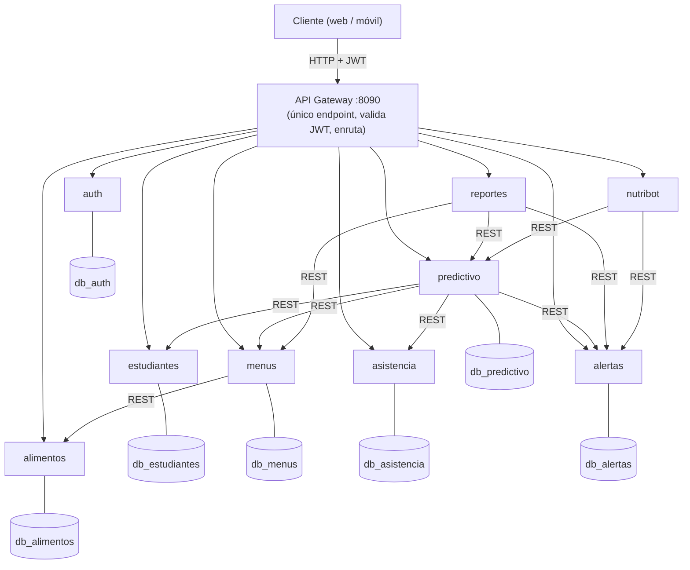

# 🧩 NutriPredict — Arquitectura de Microservicios

Implementación del sistema como un **conjunto de microservicios**, siguiendo el
material de clase *Microservicios (Ing. Carlos Pineda)*.

> El monolito original sigue intacto en la raíz del repositorio (como respaldo).
> Esta carpeta es la versión **microservicios** del mismo sistema.

---

## 🗺️ Arquitectura



`reportes` y `nutribot` **no tienen base de datos**: solo orquestan a otros servicios.

---

## ✅ Cómo cumple cada concepto del PDF

| Concepto del PDF | Implementación aquí |
|---|---|
| App como **conjunto de servicios pequeños** | 9 microservicios independientes en `services/` |
| Cada servicio: **una sola función, autónomo, aislado** | Cada uno con su dominio, su contenedor y **su propia base de datos** (`db_*`) |
| **Partes:** Controller (Endpoint) → Validator → Lógica → Acceso a datos | `public/index.php` (controller+routing) → validación → `Repository.php` (datos) |
| **Servicio Web / API REST (HTTP)** | Todos exponen endpoints REST con JSON |
| **Comunicación ligera entre servicios** | Llamadas HTTP/REST: `menus→alimentos`, `predictivo→{estudiantes,alertas,asistencia,menus}`, `reportes→{predictivo,alertas,menus}`, `nutribot→{predictivo,alertas}` |
| **API Gateway (un solo endpoint)** | `gateway/` expone `:8090`, valida **JWT** y enruta a cada servicio |
| **Autenticación en la capa externa** | `auth` emite JWT en `/login`; el gateway lo verifica en cada ruta protegida |
| **Contenedores (Docker)** | Un `Dockerfile` por servicio + `docker-compose.yml` que orquesta todo |
| **DevOps / CI/CD** | Pipeline en `.github/workflows/` (lint + análisis + pruebas) |
| **Serverless / Kubernetes** | `predictivo` y `nutribot` son candidatos serverless; el compose es trasladable a K8s (documentado en `docs/PLAN_PRODUCCION.md`) |

---

## ▶️ Cómo ejecutarlo

```bash
cd microservices
docker compose up --build
```
- **API Gateway:** http://localhost:8090
- Las bases de datos por servicio se crean y siembran solas (datos demo).

### Probarlo (con `curl`)
```bash
G=http://localhost:8090

# 1) Login → token JWT (ruta pública)
TOKEN=$(curl -s -X POST $G/api/auth/login -H 'Content-Type: application/json' \
  -d '{"email":"admin@nutripredict.edu.co","password":"demo123"}' | grep -oP '"token":"\K[^"]+')

# 2) Listar estudiantes (ruta protegida)
curl -s -H "Authorization: Bearer $TOKEN" $G/api/estudiantes/estudiantes

# 3) Crear un menú (el servicio menús consulta al de alimentos)
curl -s -H "Authorization: Bearer $TOKEN" -X POST $G/api/menus/menus \
  -H 'Content-Type: application/json' \
  -d '{"fecha":"2026-06-07","tipo_tiempo":"almuerzo","descripcion":"Arroz, frijol, pollo","items":[{"id_alimento":1,"porcion_g":150},{"id_alimento":2,"porcion_g":120},{"id_alimento":4,"porcion_g":100}]}'

# 4) Ejecutar el motor predictivo (orquesta 4 servicios)
curl -s -H "Authorization: Bearer $TOKEN" -X POST $G/api/predictivo/predictivo/ejecutar

# 5) Reporte agregado
curl -s -H "Authorization: Bearer $TOKEN" $G/api/reportes/reportes/resumen
```

Credenciales demo (contraseña `demo123`): `admin@`, `restaurante@`, `docente@`, `directora@nutripredict.edu.co`.

---

## 🔌 Endpoints (vía gateway: `/api/{servicio}/...`)

| Servicio | Endpoints principales |
|---|---|
| `auth` | `POST /login` · `GET /usuarios` |
| `estudiantes` | `GET/POST /estudiantes` · `GET/PUT/DELETE /estudiantes/{id}` · `GET /grados` |
| `alimentos` | `GET/POST /alimentos` · `DELETE /alimentos/{id}` |
| `menus` | `GET/POST /menus` · `GET /menus/cobertura` |
| `asistencia` | `GET/POST /asistencia` · `GET /asistencia/resumen` |
| `alertas` | `GET/POST /alertas` · `POST /alertas/{id}/resolver` · `GET /alertas/conteos` |
| `predictivo` | `POST /predictivo/ejecutar` · `GET /predictivo/conteos` |
| `reportes` | `GET /reportes/resumen` · `/reportes/riesgo` · `/reportes/cobertura` |
| `nutribot` | `POST /nutribot` |

Todos los servicios exponen `GET /health` (sin autenticación).

---

## 🧪 Verificación realizada
Probado de punta a punta levantando el stack y consultando por el gateway:
- Login → JWT; rutas protegidas devuelven **401 sin token** y datos con token.
- `menus` crea un menú **consultando al servicio `alimentos`** por HTTP y calcula la cobertura ICBF.
- `predictivo/ejecutar` **orquesta 4 servicios** y recalcula el riesgo de todos los estudiantes.
- `reportes/resumen` **agrega** datos de `predictivo`, `alertas` y `menus`.
- **Aislamiento de datos** confirmado: cada servicio escribe solo en su propia base (`db_*`).

---

## 📌 Notas de diseño
- **Una base de datos por servicio** (en este compose, varias bases dentro de un
  MySQL; en producción cada una sería su propia instancia).
- **JWT** firmado por `auth` y verificado por el `gateway` (secreto compartido por entorno).
- Servicios **sin estado** salvo su BD → escalables horizontalmente / aptos para Kubernetes.
